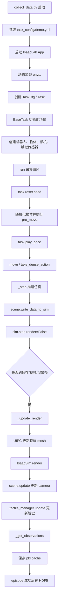

# UniVTAC Collect Data 运行流程与触觉渲染说明

本文说明一次 `collect_data.py` 数据采集运行的完整流程，重点解释 tactile 图像是如何由软体接触仿真渲染出来的。

## 总体流程

UniVTAC 的数据采集入口是 `third_party/UniVTAC/scripts/collect_data.py`。一次运行会启动 IsaacLab/IsaacSim，创建任务环境，执行 scripted expert 动作，并在动作过程中采集视觉图像、触觉图像、机器人状态和物体状态，最后保存为 HDF5 episode。



## 1. 顶层入口

入口文件：

- `third_party/UniVTAC/scripts/collect_data.py`

脚本首先读取命令行参数，例如任务名 `lift_bottle` 和配置名 `demo`，然后加载：

- `third_party/UniVTAC/task_config/demo.yml`

当前配置中，采集频率由以下字段决定：

```yaml
decimation: 1
save_frequency: 2
video_frequency: 2
render_frequency: 0
```

含义是：仿真基础频率约为 120Hz，`decimation=1` 表示每次 `_step()` 推进一个物理步，`save_frequency=2` 表示每两个 step 保存一次数据，因此实际数据保存频率约为 60Hz。

`observations` 决定每一帧保存哪些数据：

```yaml
camera: ['rgb']
tactile: ['rgb', 'rgb_marker', 'marker', 'depth', 'pose']
embodiment: ['joint', 'ee']
actor: true
```

tactile 字段含义：

- `rgb`：GelSight 仿真的触觉 RGB 图像。
- `rgb_marker`：在触觉 RGB 图像上叠加 marker 后的图像。
- `marker`：marker 的初始位置和当前位置，也就是 marker 运动场。
- `depth`：触觉软垫表面的深度图或 height map。
- `pose`：触觉传感器当前位姿。

随后脚本启动 IsaacLab App，动态加载任务模块，例如 `envs.lift_bottle`，并创建：

```text
task = Task(env_cfg, mode='collect')
```

这一步进入 `BaseTask`，开始创建底层仿真环境。

## 2. 任务环境创建

核心文件：

- `third_party/UniVTAC/envs/_base_task.py`

`BaseTask` 继承自 `UipcRLEnv`，因此这个环境不是纯 Isaac 刚体环境，而是结合了 IsaacLab 和 UIPC/TacEx 的软体仿真环境。底层环境创建时，UIPC 用来模拟 GelSight 硅胶层的形变。

`_setup_scene()` 会创建：

- 基础场景：机器人、桌面或底板、光照。
- 任务物体：例如 `lift_bottle` 中的 wall 和 bottle。
- 相机管理器：`CameraManager`。
- 触觉管理器：`TactileManager`。

其中触觉传感器由配置中的 `sensor_type: gsmini` 决定，会创建 Franka 机器人和左右两个 GelSight Mini 触觉传感器。

## 3. Reset 阶段

每个 seed 对应一个 episode。采集循环中会先执行：

```text
task.reset(seed)
```

`reset()` 负责准备 episode 初始状态：

- 设置随机种子和保存路径。
- 调用底层 UIPC/Isaac reset。
- 重置机器人、物体、触觉传感器。
- 随机化任务物体位置。
- 让物理状态稳定若干步。
- 执行具体任务的 `pre_move()`。

对于 `lift_bottle`，`pre_move()` 会根据瓶子位置计算抓取位姿，并把机器人移动到抓取前位置。默认情况下，`pre_move` 阶段不保存训练数据。

## 4. Play Once 阶段

reset 完成后，采集脚本执行：

```text
task.play_once()
```

对于 `lift_bottle`，scripted expert 的动作大致是：

```text
闭合夹爪
-> 旋转瓶子
-> 如有必要进行姿态修正
-> 移动到目标位置
-> 张开夹爪
-> 等待
```

这些高级动作会通过 `move()` 转换成底层控制序列，再由 `take_dense_action()` 逐步执行。每一个低层控制步最终都会调用 `_step(is_save=True)`。

因此，真正的数据生成核心不在 `_play_once()`，而在 `_step()`。

## 5. `_step()`：推进物理并触发渲染

核心文件：

- `third_party/UniVTAC/envs/_base_task.py`

`_step()` 是采集系统的心跳函数。它的核心顺序是：

```text
1. 判断当前 episode 是否仍然有效。
2. step_count += 1。
3. 判断这一帧是否需要保存、写视频或渲染。
4. scene.write_data_to_sim()。
5. sim.step(render=False)。
6. 如果需要图像，则调用 _update_render()。
7. 如果需要保存，则调用 _get_observations()。
8. 保存当前 observation 到临时 pkl。
```

前面 `set_arm()`、`set_gripper()` 设置的控制目标只是写到了 buffer 中。到了 `scene.write_data_to_sim()`，这些控制目标才真正提交给仿真器。随后 `sim.step(render=False)` 推进 Isaac 物理仿真，但此时还没有更新图像。

只有当当前帧需要保存、写视频或渲染时，才会进入 `_update_render()`。

## 6. 触觉仿真与渲染核心

触觉图像的生成发生在 `_update_render()` 触发的链路中：

```text
_update_render()
  -> uipc_sim.update_render_meshes()
  -> sim.render()
  -> scene.update()
  -> tactile_manager.update()
       -> gelpad.update()
       -> GelSightSensor.update()
```

触觉传感器定义在：

- `third_party/UniVTAC/envs/sensors/tactile.py`

其核心结构是：

```text
UipcObject(gelpad)
UipcIsaacAttachments
GelSightSensor(sensor_cfg, gelpad)
```

含义：

- `gelpad` 是 UIPC 中的可形变硅胶软垫。
- `attachment` 把 gelpad 绑定到机器人夹爪刚体上。
- `GelSightSensor` 使用这个 gelpad 的形变作为输入，生成触觉输出。

每次更新时，先执行 `gelpad.update()`，更新软垫形变状态；再执行 `GelSightSensor.update()`，根据当前软垫状态和内部相机深度生成触觉图像。

## 7. 触觉图像的输入

触觉渲染的输入可以分为三类。

第一类是物理输入：

```text
物体与 GelSight 软垫接触
-> UIPC 计算 gelpad 节点形变
-> 当前软垫表面形状
```

第二类是几何或图像输入：

```text
GelSight 内部小相机 depth
-> height_map
-> indentation_depth
```

第三类是渲染配置输入：

```text
resolution
clipping_range
marker_shape
marker_interval
marker_radius
camera_to_surface
real_size
optical_sim_cfg
marker_motion_sim_cfg
```

这些配置主要在 `create_gelsight_mini_cfg()` 中定义。例如 GelSight Mini 使用：

```text
resolution = 320 x 240
clipping_range = 0.024 到 0.034
marker_shape = 9 x 7
num_markers = 64
```

## 8. `tactile_rgb` 与 `marker_rgb`

TacEx 的 `GelSightSensor.update()` 内部会做三件核心事情：

```text
1. 更新内部 camera depth。
2. 计算 height_map / indentation_depth。
3. 调用 optical simulator 生成 tactile_rgb。
```

`tactile_rgb` 的生成链路是：

```text
gelpad deformation
-> camera depth / height_map
-> optical_simulator.optical_simulation()
-> tactile_rgb
```

`marker_motion` 的生成链路是：

```text
gelpad deformation
-> marker_motion_simulator.marker_motion_simulation()
-> marker 初始位置 + 当前 marker 位置
```

`marker_rgb` 的生成链路是：

```text
tactile_rgb
+ draw_markers(marker_motion)
-> marker_rgb
```

因此：

- `rgb` 是纯触觉光学图。
- `rgb_marker` 是在触觉光学图上叠加 marker 后的图。
- `marker` 是 marker 的运动信息。
- `depth` 是软垫表面的深度或高度图。

## 9. Observation 汇总与保存

当 `_step()` 判断当前帧需要保存时，会调用 `_get_observations()`。该函数根据 `demo.yml` 读取：

```text
camera_manager.get_observations()
tactile_manager.get_observations()
robot_manager.get_observations()
actor_manager.get_observations()
```

触觉部分最终进入：

```text
obs['tactile']['left_tactile']['rgb']
obs['tactile']['left_tactile']['rgb_marker']
obs['tactile']['left_tactile']['marker']
obs['tactile']['left_tactile']['depth']
obs['tactile']['left_tactile']['pose']

obs['tactile']['right_tactile'][...]
```

随后 `save_observations()` 把这一帧写成临时 pkl。整个 episode 成功后，外层 `collect_data.py` 调用 `task.save_to_hdf5()`，把 `.cache/<seed>/*.pkl` 合并成一个 HDF5 文件。

## 核心结论

一次 `collect_data` 运行中，普通视觉图像和触觉图像来源不同：

```text
普通视觉 RGB：
  IsaacSim / IsaacLab camera render
  -> cam.data.output['rgb']

触觉 RGB：
  UIPC gelpad 软体形变
  -> GelSight 内部 depth / height_map
  -> TacEx optical simulator
  -> tactile_rgb / marker_rgb
```

UniVTAC 的 tactile 图像本质上是物理驱动的合成视觉触觉图像。它以软垫接触形变为输入，经由 GelSight 内部相机深度和 TacEx 光学模型，渲染出类似真实 GelSight 的触觉 RGB 图。如果启用 marker，则进一步叠加 marker 位置变化，得到 `rgb_marker`。
